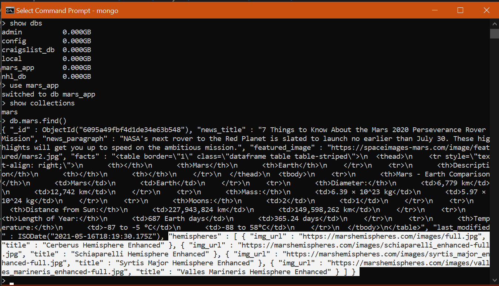

# Mission-to-Mars
## Project Overview
The following project involves scraping Mars data from different websites and embedding the scraped data into a custom web app. The web app features a button that can scrape for new data whenever it becomes available. We initially started our web app to include news, facts, and a featured image. We then added a section to include photos of Mars's hemispheres. The project displays the synergy between Python, NoSQL databases, HTML to optimize web-scrapping and data visualization. 

## Resources
- Python 3.7.6
- Jupyter Notebook
- HTML & Bootstrap 3.3.7
- MongoDB

## Updated MongoDB Database

